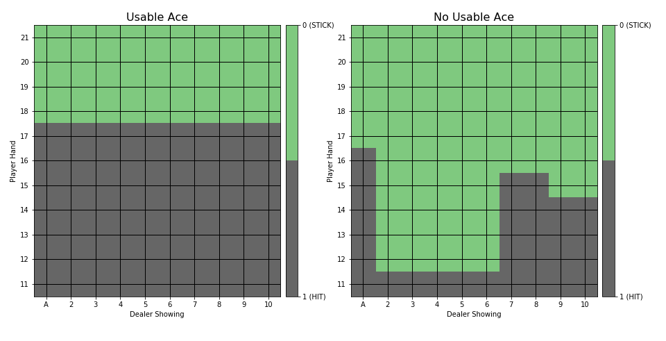

# Monte Carlo Methods and Blackjack

## Prerequisites
```
pip install gym
```

## Run
```
python blackjack.py
```

## Plot of Optimal Policy
after 10,000,000 episodes:



## Notes
See [Blog Post](https://hollygrimm.com/rl_mc) on this project


## Running the Tests
```
import blackjack_unittests as tests
tests.test_get_policy_for_observation()
```

## Acknowledgments
Chapter 5 of *Reinforcement Learning: An Introduction* by Sutton and Barto